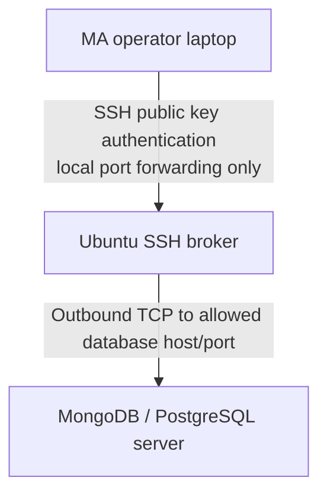

- [คู่มือสร้าง Ubuntu User สำหรับ SSH Tunnel งาน MA เท่านั้น](#คู่มือสร้าง-ubuntu-user-สำหรับ-ssh-tunnel-งาน-ma-เท่านั้น)
  - [ภาพรวมสถาปัตยกรรม](#ภาพรวมสถาปัตยกรรม)
  - [1. สร้าง user สำหรับ tunnel](#1-สร้าง-user-สำหรับ-tunnel)
  - [2. สร้าง forced command สำหรับกันการเปิด shell](#2-สร้าง-forced-command-สำหรับกันการเปิด-shell)
  - [3. ติดตั้ง public key สำหรับ user](#3-ติดตั้ง-public-key-สำหรับ-user)
  - [4. ตั้งค่า sshd ให้รองรับ authorized key path และจำกัด user](#4-ตั้งค่า-sshd-ให้รองรับ-authorized-key-path-และจำกัด-user)
  - [5. ทดสอบว่าห้าม login shell และ command](#5-ทดสอบว่าห้าม-login-shell-และ-command)
  - [6. ตัวอย่างการสร้าง tunnel](#6-ตัวอย่างการสร้าง-tunnel)
  - [7. คำแนะนำด้านความปลอดภัยเพิ่มเติม](#7-คำแนะนำด้านความปลอดภัยเพิ่มเติม)
  - [8. Checklist หลังติดตั้ง](#8-checklist-หลังติดตั้ง)

# คู่มือสร้าง Ubuntu User สำหรับ SSH Tunnel งาน MA เท่านั้น

คู่มือนี้อธิบายการสร้าง user บน Ubuntu เพื่อใช้เป็น SSH broker สำหรับงาน MA โดยมีเงื่อนไขหลักดังนี้

- Login ได้ด้วย Public key เท่านั้น
- ไม่ใช้รหัสผ่าน และ password ของ user ถูก lock
- ไม่สามารถเปิด shell, TTY, SFTP หรือรัน command บนเครื่องได้
- ใช้ได้เฉพาะ SSH local port forwarding ไปยังปลายทางที่กำหนดไว้เท่านั้น
- จำกัดตัวอย่างไว้สำหรับ MongoDB และ PostgreSQL ที่อยู่คนละเครื่องกับ SSH broker

เอกสารตัวอย่างการใช้งาน:

- [ตัวอย่าง SSH tunnel ไปยัง MongoDB](docs/mongodb-tunnel.md)
- [ตัวอย่าง SSH tunnel ไปยัง PostgreSQL](docs/postgresql-tunnel.md)

## ภาพรวมสถาปัตยกรรม



ตัวอย่างในคู่มือนี้ใช้ค่าตัวอย่างดังนี้ ให้เปลี่ยนตาม environment จริงก่อนนำไปใช้

| รายการ | ค่าตัวอย่าง |
| --- | --- |
| SSH broker | `broker.example.com` |
| Tunnel user | `ma-tunnel` |
| MongoDB host | `10.10.20.15:27017` |
| PostgreSQL host | `10.10.20.16:5432` |

## 1. สร้าง user สำหรับ tunnel

รันบนเครื่อง Ubuntu SSH broker

```bash
sudo adduser --disabled-password --gecos "" --shell /usr/sbin/nologin ma-tunnel
sudo passwd -l ma-tunnel
```

ตรวจสอบว่า user ไม่มี password ที่ใช้งานได้

```bash
sudo passwd -S ma-tunnel
```

ผลลัพธ์ควรมีสถานะ `L` หรือสถานะที่บอกว่า password ถูก lock แล้ว

## 2. สร้าง forced command สำหรับกันการเปิด shell

สร้างไฟล์ `/usr/local/sbin/ssh-tunnel-only`

```bash
sudo tee /usr/local/sbin/ssh-tunnel-only >/dev/null <<'EOF'
#!/bin/sh
echo "This account is restricted to SSH local port forwarding only." >&2
exit 1
EOF

sudo chmod 755 /usr/local/sbin/ssh-tunnel-only
sudo chown root:root /usr/local/sbin/ssh-tunnel-only
```

เมื่อผู้ใช้พยายามเปิด shell หรือรัน command ผ่าน SSH จะถูกบังคับให้รัน script นี้และออกจาก session ทันที แต่การต่อ tunnel ด้วย `ssh -N -L ...` ยังใช้งานได้ เพราะไม่ได้เปิด remote shell session

## 3. ติดตั้ง public key สำหรับ user

แนะนำให้เก็บ authorized key แบบ root-owned เพื่อให้ user แก้ key เองไม่ได้

```bash
sudo install -d -m 755 -o root -g root /etc/ssh/authorized_keys
sudo touch /etc/ssh/authorized_keys/ma-tunnel
sudo chown root:root /etc/ssh/authorized_keys/ma-tunnel
sudo chmod 644 /etc/ssh/authorized_keys/ma-tunnel
```

เพิ่ม public key ของผู้ใช้งาน MA ลงใน `/etc/ssh/authorized_keys/ma-tunnel` โดยใส่ options จำกัดสิทธิ์ไว้หน้าบรรทัด key

```text
command="/usr/local/sbin/ssh-tunnel-only",no-agent-forwarding,no-X11-forwarding,no-pty,no-user-rc,permitopen="10.10.20.15:27017",permitopen="10.10.20.16:5432" ssh-ed25519 AAAAC3NzaC1lZDI1NTE5AAAAIExamplePublicKey ma-user@example
```

ข้อควรระวัง:

- `permitopen` ต้องเป็น host และ port ที่อนุญาตให้ tunnel ไปเท่านั้น
- เพิ่ม `permitopen` ได้หลาย host หรือหลาย port โดยใส่ `permitopen="host:port"` ซ้ำใน public key บรรทัดเดียวกัน
- ถ้ามีหลาย public key ให้เพิ่มแยกคนละบรรทัด และใส่ options จำกัดสิทธิ์หน้าทุก key
- ห้ามใส่ private key บน server ให้เก็บ private key ไว้ที่เครื่องของผู้ใช้งานเท่านั้น

ตัวอย่างอนุญาตหลาย host และหลาย port ให้ key เดียวกัน

```text
command="/usr/local/sbin/ssh-tunnel-only",no-agent-forwarding,no-X11-forwarding,no-pty,no-user-rc,permitopen="10.10.20.15:27017",permitopen="10.10.20.15:27018",permitopen="10.10.20.16:5432",permitopen="10.10.20.17:5432" ssh-ed25519 AAAAC3NzaC1lZDI1NTE5AAAAIExamplePublicKey ma-user@example
```

ถ้าเพิ่มปลายทางใน `permitopen` ของ authorized key แล้ว ต้องเพิ่มปลายทางเดียวกันใน `PermitOpen` ของ `Match User ma-tunnel` ด้วย เพราะ OpenSSH จะใช้ข้อจำกัดทั้งสองชั้นร่วมกัน

## 4. ตั้งค่า sshd ให้รองรับ authorized key path และจำกัด user

เปิดไฟล์ `/etc/ssh/sshd_config`

```bash
sudoedit /etc/ssh/sshd_config
```

ถ้าใน `/etc/ssh/sshd_config` ยังไม่มี `AuthorizedKeysFile` อยู่ก่อน ให้เพิ่มบรรทัดนี้ เพื่อให้ sshd ยังคงอ่าน key จาก home directory ตามปกติ และอ่าน key จาก `/etc/ssh/authorized_keys/%u` เพิ่มด้วย

```text
AuthorizedKeysFile .ssh/authorized_keys /etc/ssh/authorized_keys/%u
```

ตัวอย่างที่ควรใช้จริง ต้องมี 2 path นี้อยู่ใน directive เดียวกัน

```text
# path เดิมของ user ปกติ + path กลางที่ root เป็นเจ้าของ
AuthorizedKeysFile .ssh/authorized_keys /etc/ssh/authorized_keys/%u
```

ตัวอย่างที่ไม่ควรใช้ เพราะจะทำให้ user ปกติที่ใช้ `~/.ssh/authorized_keys` ใช้งาน key เดิมไม่ได้

```text
# ผิด: เหลือเฉพาะ path กลาง ทำให้ path เดิมใน home directory ไม่ถูกอ่าน
AuthorizedKeysFile /etc/ssh/authorized_keys/%u
```

การตั้งค่านี้ไม่กระทบ user ปกติที่ใช้ `~/.ssh/authorized_keys` เพราะยังคงมี `.ssh/authorized_keys` อยู่เป็น path แรก เพียงแต่ค่า `AuthorizedKeysFile` เป็นการ override ค่า default ของ sshd ดังนั้นต้องใส่ `.ssh/authorized_keys` ไว้ด้วยเสมอ

ข้อควรระวังคืออย่ากำหนดเฉพาะ `/etc/ssh/authorized_keys/%u` เพราะจะทำให้ user ปกติที่ใช้ `~/.ssh/authorized_keys` login ด้วย key เดิมไม่ได้ และถ้า server มีค่า `AuthorizedKeysFile` แบบ custom อยู่แล้ว ให้รวมค่าเดิมไว้ด้วยก่อนเพิ่ม path ใหม่

เพิ่ม block นี้ไว้ท้ายไฟล์

```text
Match User ma-tunnel
    PubkeyAuthentication yes
    PasswordAuthentication no
    KbdInteractiveAuthentication no
    AuthenticationMethods publickey
    PermitTTY no
    X11Forwarding no
    AllowAgentForwarding no
    AllowTcpForwarding local
    AllowStreamLocalForwarding no
    PermitTunnel no
    PermitOpen 10.10.20.15:27017 10.10.20.16:5432
    PermitListen none
    GatewayPorts no
    ForceCommand /usr/local/sbin/ssh-tunnel-only
```

ตรวจสอบ syntax และ reload sshd

```bash
sudo sshd -t
sudo systemctl reload ssh
```

ถ้า `sshd -t` แจ้งว่าไม่รู้จัก `PermitListen` ให้ลบบรรทัด `PermitListen none` ออกได้ โดยยังคงมี `AllowTcpForwarding local` เพื่อปิด remote forwarding อยู่

## 5. ทดสอบว่าห้าม login shell และ command

จากเครื่องผู้ใช้งาน MA

```bash
ssh -i ~/.ssh/ma_tunnel_key ma-tunnel@broker.example.com
```

ควรเห็นข้อความว่า account นี้ถูกจำกัดไว้สำหรับ tunnel เท่านั้น และ connection ถูกปิด

ทดสอบการรัน command

```bash
ssh -i ~/.ssh/ma_tunnel_key ma-tunnel@broker.example.com "whoami"
```

ควรถูกปฏิเสธในลักษณะเดียวกัน ไม่ควรได้ผลลัพธ์ `ma-tunnel`

## 6. ตัวอย่างการสร้าง tunnel

สร้าง tunnel ไป MongoDB

```bash
ssh -i ~/.ssh/ma_tunnel_key -N \
  -L 127.0.0.1:27017:10.10.20.15:27017 \
  ma-tunnel@broker.example.com
```

จากนั้นเชื่อมต่อ MongoDB ผ่านเครื่อง local

```bash
mongosh "mongodb://127.0.0.1:27017"
```

สร้าง tunnel ไป PostgreSQL

```bash
ssh -i ~/.ssh/ma_tunnel_key -N \
  -L 127.0.0.1:15432:10.10.20.16:5432 \
  ma-tunnel@broker.example.com
```

จากนั้นเชื่อมต่อ PostgreSQL ผ่านเครื่อง local

```bash
psql -h 127.0.0.1 -p 15432 -U app_user -d app_db
```

ดูรายละเอียดเพิ่มได้ที่:

- [MongoDB tunnel](docs/mongodb-tunnel.md)
- [PostgreSQL tunnel](docs/postgresql-tunnel.md)

## 7. คำแนะนำด้านความปลอดภัยเพิ่มเติม

- จำกัด firewall ของ database server ให้รับ connection จาก SSH broker เท่านั้น
- จำกัด firewall ของ SSH broker ให้รับ SSH จาก IP ของทีม MA หรือ VPN เท่านั้น
- ใช้ key แยกต่อคน ห้ามแชร์ private key
- ใส่ comment ใน public key เพื่อระบุเจ้าของ key เช่น `ma-user@example`
- กำหนดอายุ key หรือ review key เป็นรอบ เช่น ทุก 30 หรือ 90 วัน
- เปิด log และตรวจสอบ `/var/log/auth.log` เป็นระยะ
- ถ้าต้องการอนุญาตปลายทางเพิ่ม ให้แก้ทั้ง `permitopen` ใน authorized key และ `PermitOpen` ใน `sshd_config`

## 8. Checklist หลังติดตั้ง

- [ ] `ma-tunnel` ถูก lock password แล้ว
- [ ] user ใช้ shell เป็น `/usr/sbin/nologin`
- [ ] public key อยู่ใน `/etc/ssh/authorized_keys/ma-tunnel`
- [ ] key ทุกบรรทัดมี `command=`, `no-pty`, และ `permitopen`
- [ ] `Match User ma-tunnel` ตั้งค่า `PasswordAuthentication no`
- [ ] `AllowTcpForwarding local` ถูกตั้งค่าแล้ว
- [ ] `PermitOpen` จำกัดเฉพาะ host/port ที่จำเป็น
- [ ] `sudo sshd -t` ผ่าน
- [ ] ทดสอบเปิด shell แล้วถูกปิด
- [ ] ทดสอบ tunnel ไป MongoDB/PostgreSQL แล้วใช้งานได้
